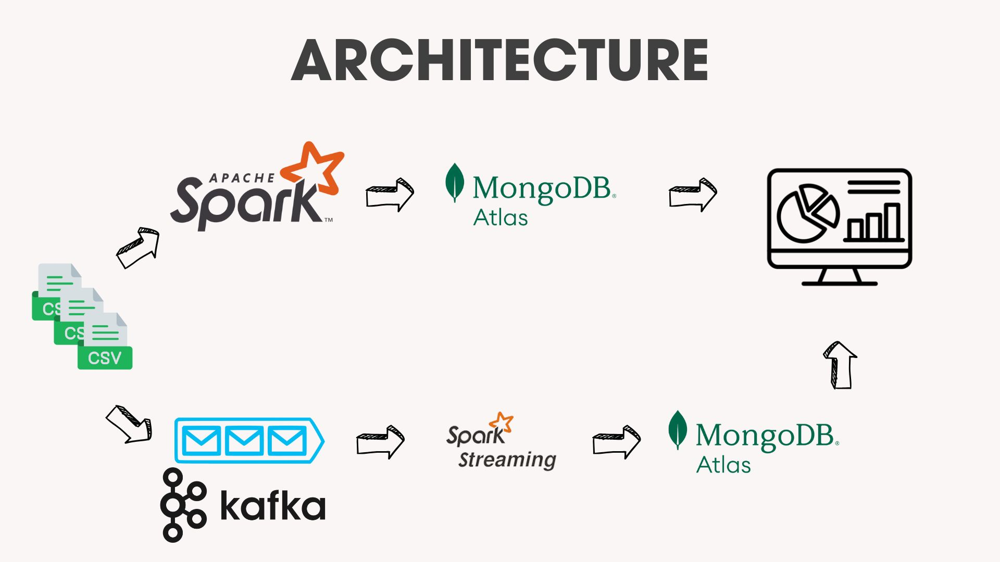

# Sales Management Dashboard

The **Sales Management Dashboard** project designed to streamline and visualize sales data, enabling businesses to make informed decisions based on real-time analytics. Built using Java and Apache Spark, this dashboard offers insights into sales trends, performance metrics, and more.

## Technologies Used

- **Java**: Primary programming language for backend development.
- **Apache Spark**: Handles large-scale data processing and analytics.
- **Apache Kafka**: Facilitates real-time data streaming.
- **MongoDB Atlas**: Cloud-hosted NoSQL database service used for storing processed sales data and enabling fast queries.
- **MongoDB Atlas Dashboard**: Used for visualizing sales data and creating interactive dashboards.
- **Maven**: Build automation and dependency management.

## Presentation
You can view the full presentation with a demo [here](https://www.canva.com/design/DAGErHIbbc8/qv87-XjTf3Z40KwmDbaoCQ/edit).
This project was presented as part of a data engineering and real-time analytics module. The Canva slides detail the architecture, implementation strategy, and key insights gained during development.

## Architecture

